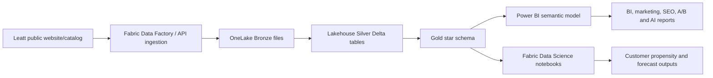

# Architecture

## Data layers

Bronze:
Raw product JSON, parquet transaction fact, source screenshots, source register.

Silver:
Cleaned product variant, customer, transaction, date, geography, channel, and campaign tables.

Gold:
BI-ready star schema and aggregation tables for revenue, margin, returns, marketing, and ML scoring.

ML:
Repurchase propensity, customer value segmentation, revenue forecasting, recommendation roadmap, and return-risk opportunities.

BI:
Executive dashboard, product/category performance, customer intelligence, marketing ROI, A/B testing, SEO roadmap, competitor analysis, and Azure credit plan.
