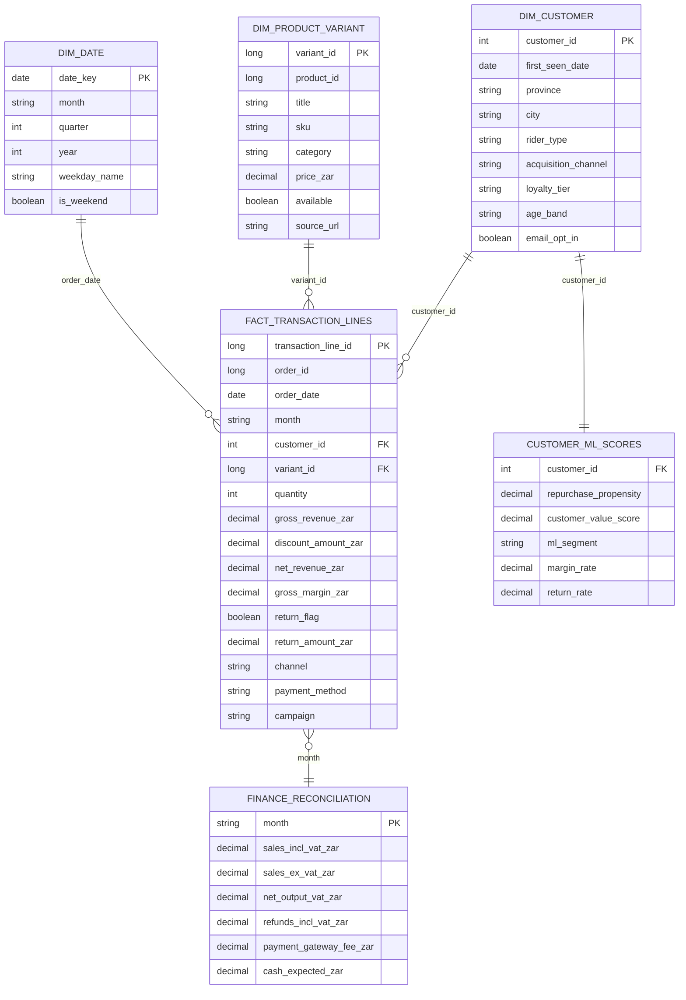

# Leatt Ecommerce BI/ML ERD

## Physical proof

- `fact_transaction_lines`: 2,000,000 rows
- `dim_customer`: 180,000 rows
- `dim_product_variant`: 11,354 rows
- Local full fact file: `outputs/leatt_ecommerce_transactions_2m.parquet`
- Local warehouse: `outputs/leatt_ecommerce_warehouse.sqlite`
- Fabric target: OneLake / Lakehouse `Files/Bronze/leatt_ecommerce_transactions_2m.parquet`, then load to Delta table.
